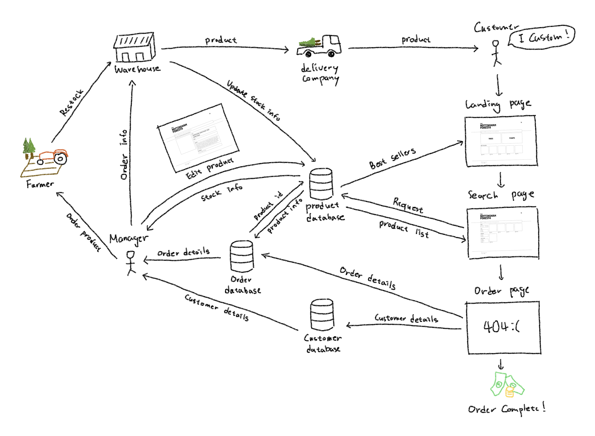
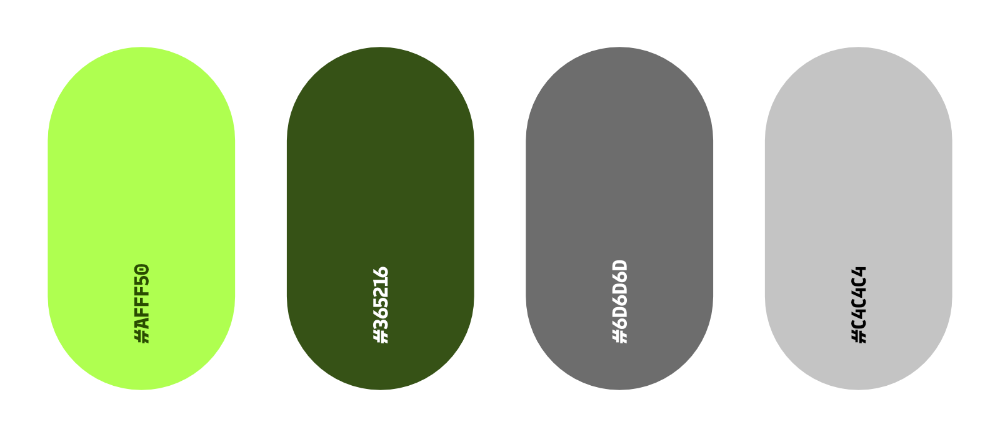
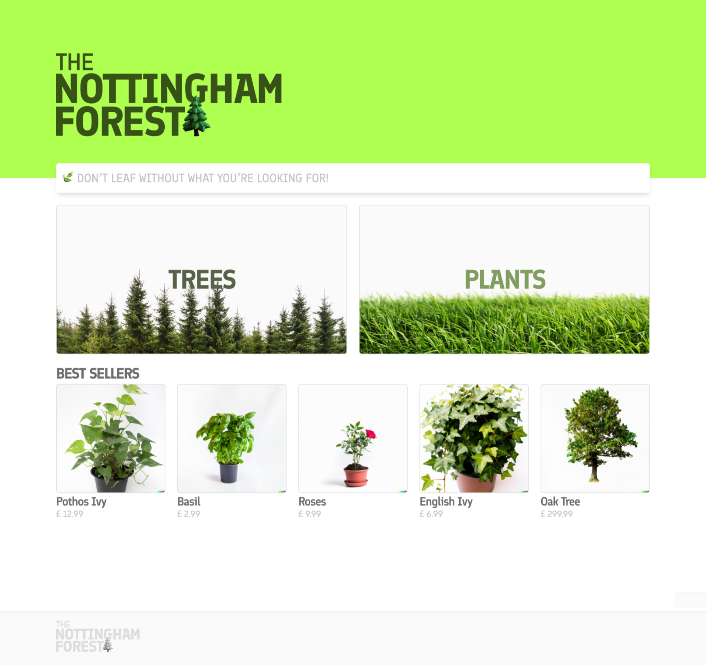
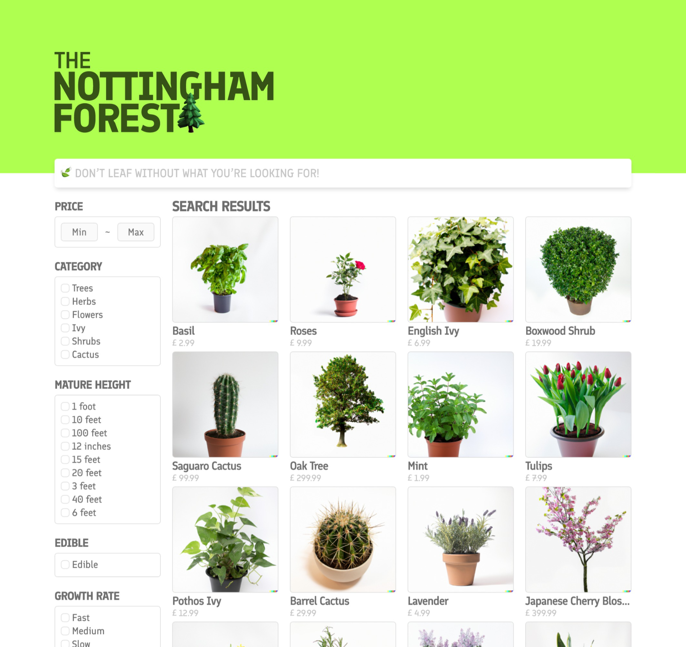
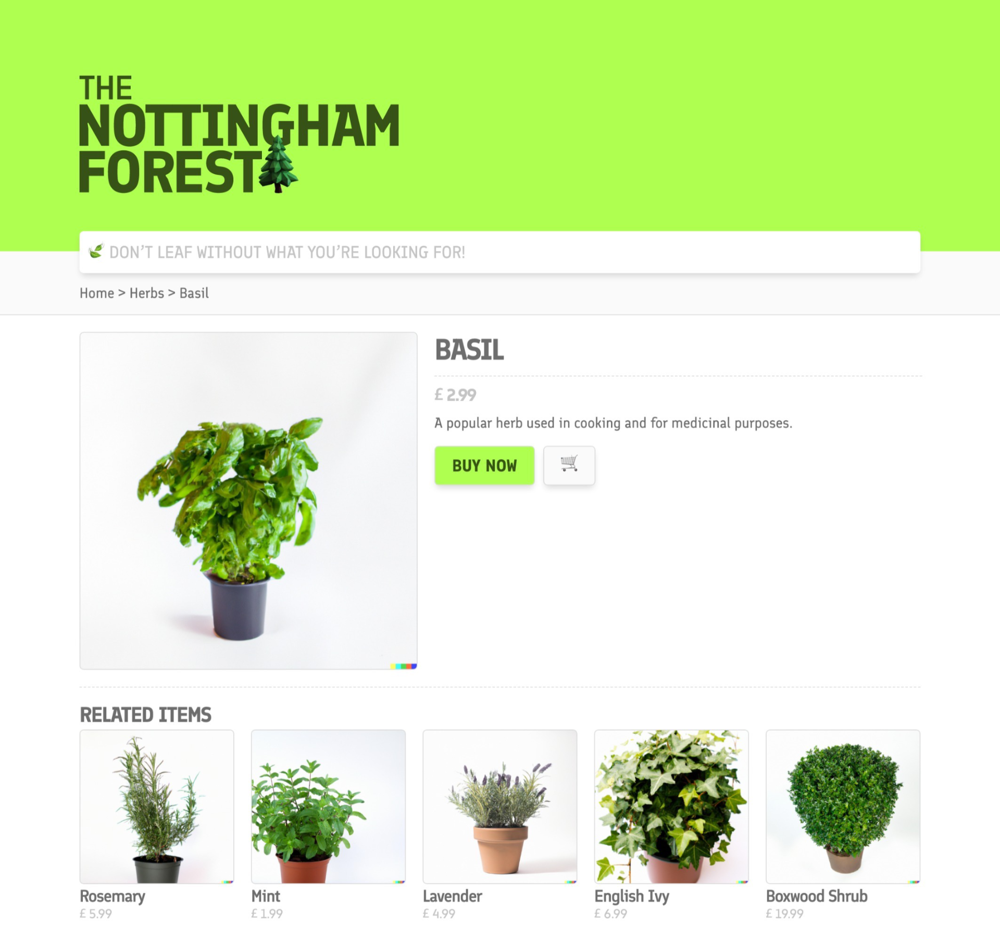
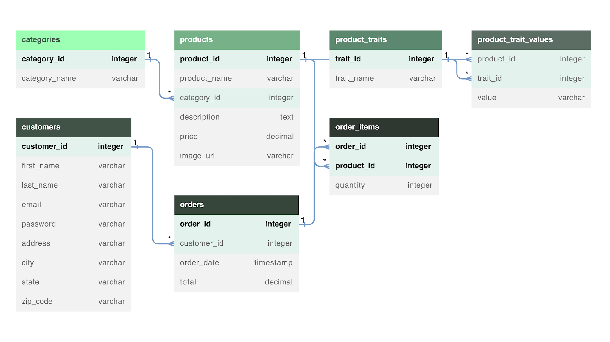

# The Nottingham Forest
> A mock e-commerce website for BUSI4493 22-23

This is a mock website for a fictitious company that specialises in delivering trees and plants to its customers.
We have named it ‘The Nottingham Forest’ because what else would it be called?

## Use-case Analysis


## Interface Design
### Colour palette

The bright and attention-grabbing **#AFFF50** was selected to represent growth and renewal, while the natural and earthy **#365216** complements the brighter green hue. The medium grey **#6D6D6D** provides contrast for text and design elements, and the light grey **#C4C4C4** creates a feeling of openness and space as a background or border element.

### Font
The font **Finlandica** was chosen for its compatibility with the forestry theme of the website. With its bold and rustic appearance, it evokes a sense of nature and earthiness that aligns perfectly with the website's purpose.

### Screenshots
index.php                                                 | search.php                                                | product.php                                               
 :--------------------------------------------------------:| :--------------------------------------------------------:| :--------------------------------------------------------:
    |   | 

## Database
### Database schema

The Nottingham Forest database was created to efficiently store and manage data on products, customers, and orders. The categories table is connected to the products table by a foreign key, allowing each product to be assigned to a certain category. The product traits and product trait values databases were designed to hold extra product information that may differ between products, whilst the customers table contains information about each registered customer. Orders and order item tables are connected to the customers and products tables, allowing orders to be placed and tracked for each client. The design provides for quick data access and processing, making it ideal for an e-commerce website.

### Key queries
#### Search query
The search bar and side bar traits are used to retrieve a list of products that match the keywords and selected traits.
```sql
SELECT products.product_id, products.product_name, products.price, products.image_url, GROUP_CONCAT(product_traits.trait_id, ':', product_trait_values.value SEPARATOR ', ') AS traits
FROM products
JOIN product_trait_values ON products.product_id = product_trait_values.product_id
JOIN product_traits ON product_trait_values.trait_id = product_traits.trait_id
JOIN categories ON products.category_id = categories.category_id

# Keyword search from the search bar
WHERE (
	products.product_name LIKE '%search_keyword%'
	OR products.description LIKE '%search_keyword%'
	OR categories.category_name LIKE '%search_keyword%'
	OR product_trait_values.value LIKE '%search_keyword%'
)
GROUP BY products.product_id

# Trait selections from the side bar
HAVING 
	(traits LIKE "%trait1:value1%")
	AND (traits LIKE "%trait2:value1%" OR traits LIKE "%trait2:value2%") ...
```

#### Related products query
Retrieves a list of 5 products that have the most matching traits.
```sql
SELECT products.product_id, products.product_name, products.price, products.image_url
FROM products
INNER JOIN product_trait_values ptv ON products.product_id = ptv.product_id
INNER JOIN product_trait_values ptv2 ON ptv.trait_id = ptv2.trait_id AND ptv.value = ptv2.value
WHERE products.product_id <> $pid
AND ptv2.product_id = $pid
GROUP BY products.product_id
ORDER BY COUNT(*) DESC
LIMIT 5;
```

#### Best sellers query
Retrieves a list of 5 products with highest sale numbers.
```sql
SELECT products.product_id, products.product_name, products.price, products.image_url, SUM(order_items.quantity) as total_sales
FROM order_items
JOIN products ON order_items.product_id = products.product_id
GROUP BY products.product_id
ORDER BY total_sales DESC
LIMIT 5;
```

#### New product query
Add new product to the database.
```sql
INSERT INTO products (product_name, category_id, description, price, image_url)
VALUES ('Basil', 2, 'A popular herb used in cooking and for medicinal purposes.', 2.99, './images/product_photos/basil.png');

SET @product_id = LAST_INSERT_ID();

INSERT INTO product_trait_values (product_id, trait_id, value)
VALUES
(@product_id, 2, 'Edible'),
(@product_id, 3, 'Fast'),
...
```

#### Product update query
Update product details and trait values on existing products.
```sql
UPDATE products
SET product_name = '$product_name', category_id = $category_id, description = '$description', price = $price, image_url = '$image_url'
WHERE product_id = $pid;

# Delete all previous traits related to the product
DELETE FROM product_trait_values WHERE product_id = $pid;

# Insert new trait values
INSERT INTO product_trait_values (product_id, trait_id, value)
VALUES
(@product_id, 2, 'Edible'),
(@product_id, 3, 'Fast'),
...
```